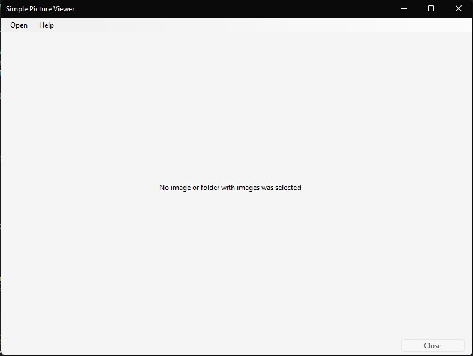
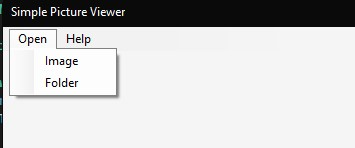
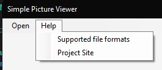
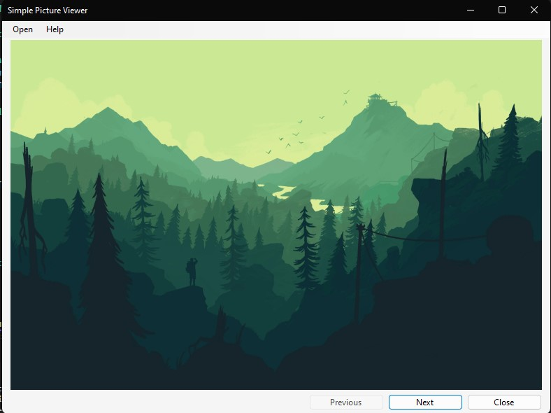
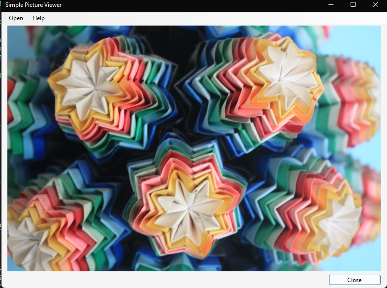

# Simple Picture Viewer

It is a the simplest picture viewer with basic options. Choose a folder or specific image and it displays in the app. Navigate between images in selected folder using <kbd>A</kbd> or <kbd>D</kbd> or in app buttons.

# Requiremenets

- [.NET Desktop Runtime 6.0](https://dotnet.microsoft.com/en-us/download/dotnet/6.0)
- OS: Windows

# Project showcase

## App after start

## Menu bar options

## Image open type and folder open type

