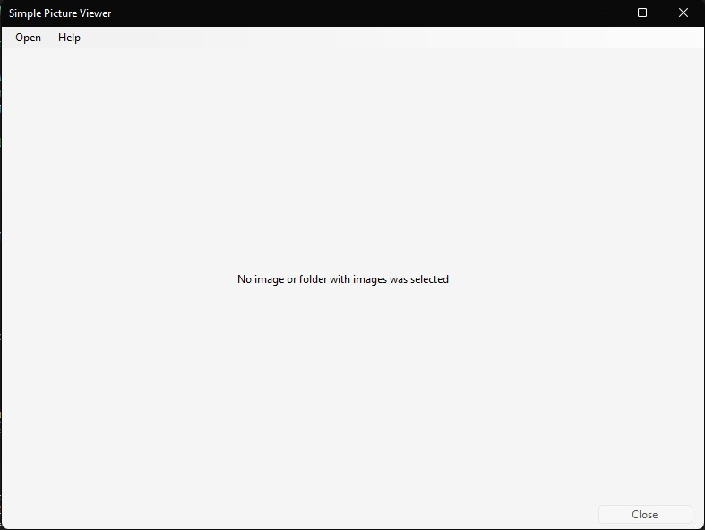
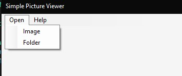
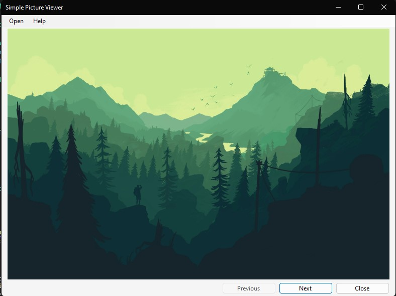
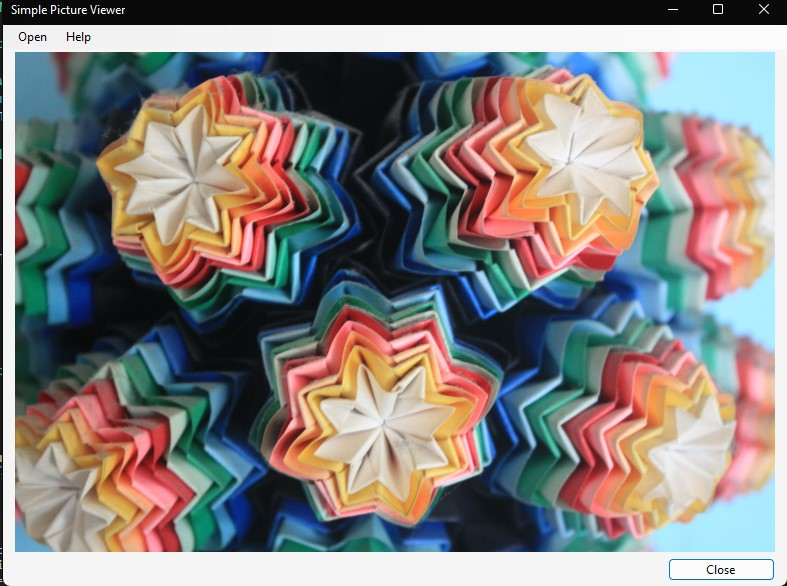

# Simple Picture Viewer

It is a the simplest picture viewer with basic options. Choose a folder or specific image and it displays in the app. Navigate between images in selected folder using <kbc>A</kbc> or <kbd>D</kbd> or in app buttons.

# Project Showcase

## App after start

## Menu bar options

## Image open type and folder open type

